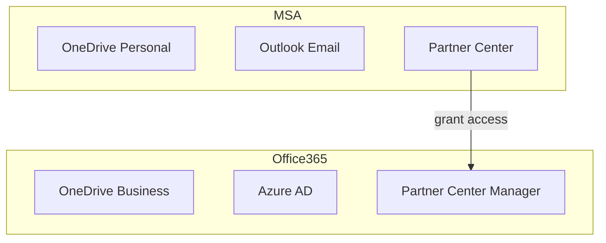

### Two Different Types of Microsoft Accounts

Microsoft has two different account types. Microsoft Account(MSA) and Office 365 account.

[this article](https://tellus-consulting.com/microsoft-account-msa-compared-to-office-365-account/) explains differences between Microsoft Accounts(MSAs) and Office 365 accounts well.

In short, there exist two different types of Microsoft accounts: MSA and Office 365, and each account has access to some unique services.

We can login with different type of accounts as shwon in the picture above. One with name tag is Office 365 account, and the other one is MSA.

However, I didn't know that each account type has own access to different services when I was working on Windows Store payments. To implement payments functionality, I should handle stuffs related to **Partner Center**(for app submission) and **Azure AD**(for validating purchase for `Windows.Services.Store` namespace payments). After I worked on implementing payments functionality, I could draw a brief diagram for Microsoft accounts like:

Followings are little lessons I learned while working:

### (1) MSA can't use Azure AD

You can't manage Azuare AD settings if your account is MSA.

For example, you will see pages with error messages like below if you go to Azure portal with MSA:

")
")
")

However, the error messages are not descriptive enough. They just show messages like:

- Unable to complete due to service connection error, please try again later.
- Unable to get the list of domains. Please try again later.
- Unable to complete due to service connection error, please try again later.

not something like "Permission Denied". Even the messages seems to indicate as if it is a temporary problem.

Fortunately, I also found an error message showing the adequate reason why I can't use Azure AD:

> Access denied
>
> You do not have access
>
> Looks like you don't have access to this content. To get access, please contact the owner.

")

Thanks to the message, finally I could find out that MSA account can't use Azure AD.

### (2) Office 365 Account can't manage Microsoft Store App at Partner Center by itself

MSA can't use Azure AD, but MSA can submit app to Windows Store using Partner Center.

On the contrary, Office 365 account can't submit app to Windows Store using Partner Center by itself.

If you click *Get started* at *Developer programs > Windows*,

you will see error messages like this:

We should notice the first line of the error messages:

- **Sign in with an Azure AD user account that is already associated with a Partner Center account**
- Sign in with a Microsoft account that is already associated with a Partner Center account
- Sign in with a Microsoft account that you'd like to register for a new Partner Center account

Inferencing from the first error message, we can expect that the way to associate Azure AD account with Partner Center exists.

It's true, see following:

### (3) Office 365 Account get control to Partner Center by MSA account

MSA can allow Office 365 account to manage Partner Center by placing an Office 365 account as manager.

You can follow [this document](https://docs.microsoft.com/en-us/windows/uwp/publish/associate-azure-ad-with-partner-center) to achieve this.

If you complete granting access to Office 365 account, you will see page like this:

By doing this, you can use Office 365 account instead to manage Partner Center page.
